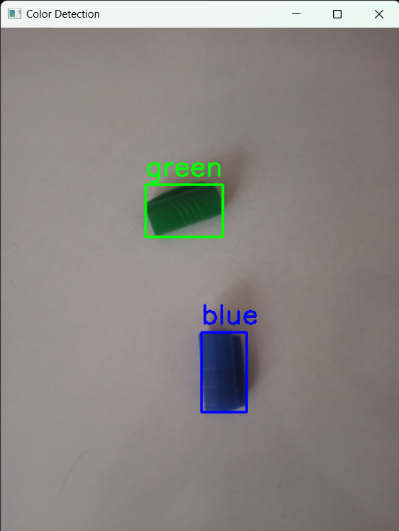

# Color detection

Real-time color detection in video using **OpenCV** , **Numpy** and **Pillow** libraries




---

## Key Features

- **Feature 1**: Real time detection.
- **Feature 2**: can add different colors.
- **Feature 3**: It can be used in industrial projects.

---

## Installation

Follow these steps to install and run the project:

1. Clone the repository:
   ```bash
   git clone https://github.com/The_AMIRH0SSEIN/Color_Detection.git
   ```
2. Install the required modules:
   ```bash
   pip install opencv-python
   pip install pillow
   pip install numpy
   ```
3. Then run the code and enjoy
